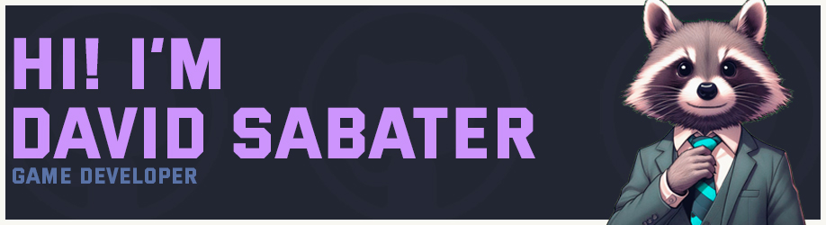

<h2 align="center">Welcome to my profile!</h2>

    

<h2>About Me</h2>

Greetings! 👋 I'm David Sabater Real, a passionate 20-year-old. Although I recently started my journey into the programming realm, I've discovered a burning passion for this fascinating universe. My lifelong love for video games inspires me to embark on the thrilling path of development. Join me as I merge my passion for gaming with code to create unique experiences! 🎮💻✨

<h2>Languages ​​and Technologies💻</h2> 

     
---
    
---
  
---

<h2>Contact Me</h2>

- contact@davidsabater.com

<h2>Discord Status</h2>

