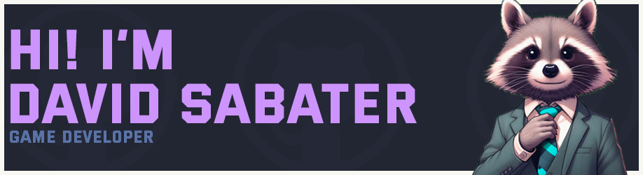

<h2 align="center">Welcome to my profile!</h2>

    

## About Me

Hi! 👋 I'm David Sabater Real, a 23-year-old passionate about technology, programming, and data.

I'm currently building my path into the world of **Data Analysis and Data Science**, developing my skills in Python, SQL, data visualization, statistics, and machine learning.

My lifelong passion for competitive video games has inspired me to combine **gaming and data**, exploring how data can be used to understand performance, discover patterns, and make better decisions.

I'm currently working on **Riftelligence**, a personal project focused on League of Legends esports analytics, where I'm putting my knowledge into practice while learning how to build real-world data projects from end to end.

I'm at the beginning of this journey, but I'm excited to keep learning, building, and improving every day. 📊🐍🎮

## Languages ​​and Technologies💻</h2> 

     
---
    
---
  
---

---
  

## Contact Me

## Social Media

